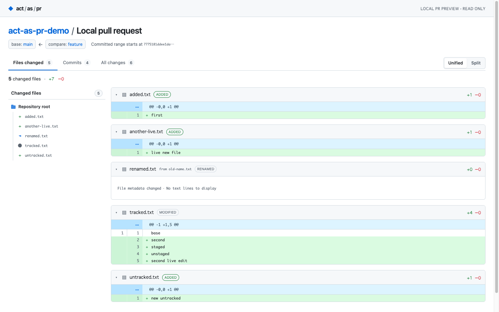
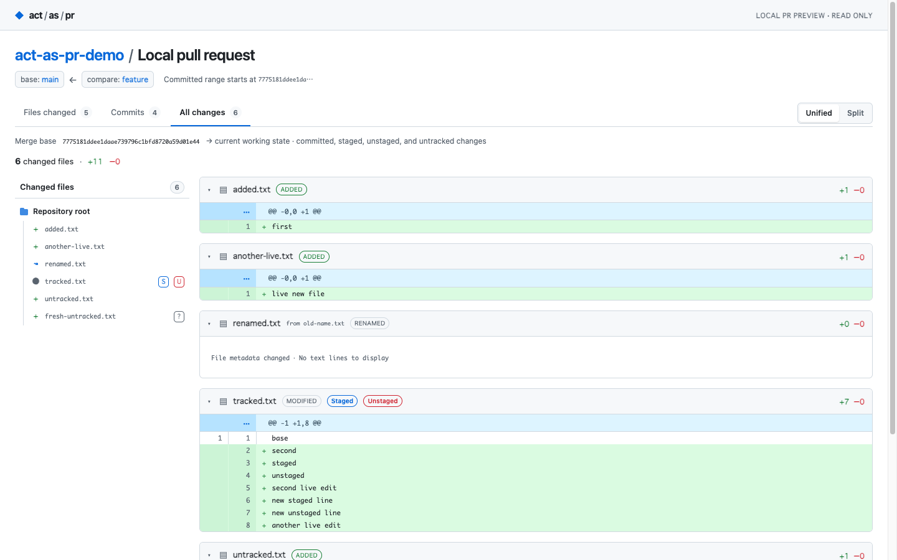

# act-as-pr

`act-as-pr` renders your local Git branch as if it were a GitHub pull request. It is a read-only preview: it does not create a real PR or send review data anywhere.



## Install

Requires Go 1.23 or newer and Git. Install without cloning the repository:

```sh
go install github.com/YoshitsuguFujii/act-as-pr@latest
```

Ensure `$(go env GOPATH)/bin` (or your `GOBIN`) is on `PATH`. From a source checkout, you can also run `go install .` or build a standalone binary:

```sh
go build -o act-as-pr .
```

## Use

Run from any directory inside a Git repository. The normal command creates a snapshot, opens it, and exits:

```sh
act-as-pr main
act-as-pr master
act-as-pr HEAD~3
```

To keep the preview live while files change, add `--watch` (either flag ordering works):

```sh
act-as-pr main --watch
act-as-pr --watch main
```

This starts a local server, opens the preview, and runs until Ctrl-C. The page updates automatically as files are edited, staged, or committed.

The base argument is required. Both modes offer three views:

| View | Comparison | Contents |
| --- | --- | --- |
| **Files changed** | `merge-base(base, HEAD) → HEAD` | Committed branch changes only. This is the original PR-style view. |
| **Commits** | `merge-base(base, HEAD)..HEAD` | Each commit and its individual diff, plus a separate **Uncommitted changes** item when the working state differs from `HEAD`. |
| **All changes** | `merge-base(base, HEAD) → current working state` | Committed, staged, unstaged, and untracked changes together. |

In **All changes** and **Uncommitted changes**, file headers label staged, unstaged, and untracked work. The file navigation uses matching `S`, `U`, and `?` markers. A file can show both Staged and Unstaged when it has changes in both places.



Each normal commit detail compares its first parent to the commit; merge commits also use their first parent. A root commit compares against the empty tree. **Uncommitted changes** compares `HEAD` with the current working state, including staged, unstaged, and untracked files. Ignored files are excluded.

Snapshot mode writes one self-contained HTML file under the OS temporary directory and opens it with the macOS default browser (`xdg-open` on Linux). It uses `file://`, makes no network requests, starts no server, and exits immediately. The file contains the data for all three views and every commit detail. The page supports Unified and Split diff views, file navigation, folding, line numbers, and the system light/dark theme.

Watch mode serves the same viewer on `127.0.0.1` at an OS-assigned port. A read-only poll of the repository runs every 750 ms. When the view data changes, a Server-Sent Event tells the browser to reload the page. The viewer restores its selected tab, selected commit where still available, diff mode, folded files, navigation scroll, and page scroll. A brief reload may be visible for large previews.

## Safety

Git is invoked with argument arrays for read-only commands. Neither mode writes to the repository, index, refs, remotes, or Git config. Untracked files are read directly without staging them. Repository paths and diff text are HTML-escaped; the page uses a restrictive Content Security Policy and contains its CSS and JavaScript locally. No authentication, telemetry, GitHub API, external assets, or external communication is used.

Generated snapshot files contain the displayed source diffs and are stored with user-only permissions (`0600`) in the OS temporary directory. Watch mode exposes those diffs through a loopback-only server at a random ephemeral port. Its URL contains a fresh, unguessable per-process session token, required by both the page and event endpoint. The server provides GET/HEAD routes only and stops when the process is interrupted. Anyone with access to that URL while the process runs can read the preview, so treat the URL as sensitive.

## Limits

- Git command output is limited to 32 MiB. The complete preview has a 32 MiB aggregate patch budget, at most 200 PR-range commits, 1,000 untracked files, 2,000 files per view, and a 128 MiB HTML output limit. Exceeding a limit produces an error rather than silently omitting data. Both display modes and all commit details are included in the page, so large previews can still take time to render.
- Binary changes display a placeholder; binary content is not decoded.
- Syntax highlighting covers common source file extensions and a small keyword set. It is intentionally lightweight.
- The OS needs a configured default browser for automatic opening. If opening fails, the command reports the saved HTML path.
- Windows browser opening is not implemented.
